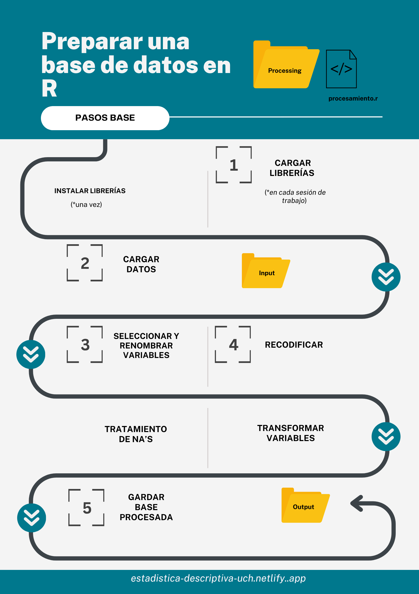

### Sesión de hoy: Conceptos claves

En la sesión de hoy, retomaremos nuestro flujo de trabajo IPO. Para ello, es importante recordar la estructura de nuestro trabajo, la cual debe tener la siguiente ruta: 

```plaintext
Rproject/
├── input/
│   └── data/
│       
├── processing/
│   └── procesamiento.R/
│       
└── output/
    └── datos-procesados.Rdata/
```

#### Pasos procesamiento




::: {.callout-important}
La siguiente práctica considera la realización de los contenidos aprendidos en la sesión 1. Es decir, los ejercicios a realizar a continuación, son realizados en un **script de R**, alojado en un Rproject.

En caso de dudas, consultar [Lectura 1](https://estadistica-descriptiva-uch.netlify.app/assignment/01-practico#flujo-de-trabajo-en-r)

:::

A continuación se presentará un caso general en que se deben **procesar los datos** para una investigación sobre "Percepciones respecto a los roles de género". Las *intrucciones* sobre dicho procesamiento serán detalladas en cada *ejercicio.* 

Recuerde que deben seguir la lógica de procesamiento aprendida en la [lectura de hoy](https://estadistica-descriptiva-uch.netlify.app/assignment/03-practico). 


**Datos**: Se utilizan los datos del Estudio Longitudinal Social de Chile (ELSOC) realizado por [COES](https://coes.cl/encuesta-panel/).Recuerden que siempre es importante trabajar con el manual/libro de códigos de las bases de datos. El manual de la ELSOC 2022 lo pueden encontrar [aquí](https://coes.cl/wp-content/uploads/Listado-de-Variables-ELSOC-2.xlsx).


**Objetivo de la investigación**: Se busca distinguir las percepciones sobre los roles de género en tramos etarios y personas identificadas políticamente a la izquierda.   

Por ende, se trabajará con las siguientes **variables**: 

 
- **Percepciones de los roles de género**: Se tienen 5 preguntas
  - "Las mujeres tienden a ser más refinadas y a tener mejor gusto que los hombres" (g01_01)
  - "Las mujeres deberían ser queridas y protegidas por los hombres" (g01_02) 
  - "En nombre de la igualdad, muchas mujeres intentan conseguir ciertos privilegios" (g01_03)
  - "Generalmente, cuando una mujer es derrotada limpiamente se queja de haber sufrido discriminación"(g01_04) 
  - "Cuando no hay muchos trabajos disponibles, los hombres deberían tener más derecho a un trabajo que las mujeres"(g01_05)
- **Edad**: m0_edad
- **Identificación política**: "Usando una escala de 0 a 10 donde 0 es ser de "izquierda", 5 es ser de "centro" y 10 es ser de "derecha", ¿Dónde se ubicaría usted en esta escala? (c15)

### Ejercicio 1

Importe los datos a utilizar. Para ello descargue la base de datos ELSOC 2022 en el siguiente [link](). 

### Ejercicio 2

Utilizando `select()` Seleccione las variables necesarias para el análisis.  
 

### Ejercicio 3

Siguiendo la lógica de la limpieza inicial de los datos, limpie las variables seleccionadas en el Ejercicio 2.

- Para ello, utilice las funciones `recode()` y `na.omit()` cuando corresponda. 


### Ejercicio 4

Utilizando `mutate()` y `case_when()` transforme la variable edad a tramos etarios, considerando 3 tramos: 

- Jóvenes
- Adultos
- Adultos mayores


Utilizando `mutate()` e `if_else()` transforme la variable de identificación política para que pueda medir la identificación con la izquierda política en una variable de dos categorías ("Sí" y "No")

- Al tratarse de una escala de 11 puntos, propongan un umbral dentro de aquel puntaje que distinga ser o no de izquierda. Recuerde que dentro de dicha escala *0 es ser de "izquierda", 5 es ser de "centro" y 10 es ser de "derecha"*. 


### Ejercicio 5

Considerando todas las modificaciones realizadas a su objeto en los ejercicios anteriores, guarde el objeto procesado en su carpeta "Output".  

### Ejercicio 6

Considerando los contenidos vistos en la [clase anterior](https://estadistica-descriptiva-uch.netlify.app/assignment/02-ejercicio-practico), responda:

- ¿Qué tipo(s) de objeto(s) estamos utlizando en el ejercicio?
- Mencione algún vector que este presente en el ejercicio
- Indique la naturaleza de las variables 

::: {.callout-note}
Recuerde usar la función `class()` y el operador `$`, el cual nos permite identificar un objeto de estructura de datos distinta comtenido en otro objeto (por ejemplo, un vector que se encuentra dentro de un data.frame)
:::
